# Modeling System Context

Use this skill to model what is inside the system under discussion and what interacts with it from outside. Keep the output at context level, not internal architecture level.

## Core Rules

- State the explicit system boundary before writing tables or diagrams.
- Classify every named item as one of: actor, external system, internal component, inside-scope capability, out-of-scope item, or unresolved boundary item.
- Classify APIs, workers, databases, queues, schedulers, services, and modules as internal components, not actors.
- Include external systems named or implied by integrations, upstream data, downstream data, identity, payment, messaging, documents, analytics, compliance, storage, or support workflows.
- Capture input and output data flow across the boundary.
- Produce the context diagram in DOT.
- List unresolved boundary questions instead of hiding ambiguity.

## Required Output

Produce these sections in order:

1. System Boundary
2. Classification Table
3. Input/Output Data-Flow Table
4. DOT Context Diagram
5. Unresolved Boundary Questions

## System Boundary

Name the system and state what is inside the boundary in one or two sentences. If the prompt implies multiple possible boundaries, choose the smallest useful boundary, mark that choice as provisional, and list alternatives in unresolved boundary questions.

## Classification Table

| Item | Classification | Inside boundary? | Reason |
| --- | --- | --- | --- |

Classification values:
- `actor`: external person, role, group, organization, or team that uses, operates, approves, or is affected by the system.
- `external system`: software, hardware, service, platform, data source, or data destination outside the boundary.
- `internal component`: implementation part inside the system; exclude from context diagram.
- `inside-scope capability`: behavior owned by the modeled system but not a separate actor or external system.
- `out-of-scope item`: known item intentionally outside the modeled context.
- `unresolved boundary item`: item that needs confirmation before it can be placed.

## Input/Output Data-Flow Table

| Source | Target | Direction | Data flow | Trigger or frequency | Notes |
| --- | --- | --- | --- | --- | --- |

Rules:
- Include each actor and external system that exchanges data with the system.
- Use `input`, `output`, or `bidirectional` from the system's perspective.
- Name business data, commands, events, documents, notifications, or decisions, not protocol details unless required.
- Mark unknown flows as questions in the notes and repeat them in unresolved boundary questions.

## DOT Context Diagram

Output a DOT diagram with:
- one cluster or clearly labeled node for the system boundary;
- actors and external systems outside that boundary;
- arrows labeled with data flows;
- no internal components unless they are explicitly marked `unresolved` or `candidate internal component` to explain an unresolved boundary choice.

Use this shape convention when possible:

```dot
digraph context {
  rankdir=LR;
  node [shape=box];

  subgraph cluster_system {
    label="System boundary: <System Name>";
    system [label="<System Name>", shape=box, style=filled];
  }

  actor [label="<Actor>", shape=oval];
  external [label="<External System>", shape=box];

  actor -> system [label="<input data flow>"];
  system -> external [label="<output data flow>"];
}
```

## Quality Check

Before returning, verify:

- Boundary is explicit and visible before the diagram.
- Actors are not confused with internal components.
- External systems are present when integrations or data exchange imply them.
- Every diagram edge has a matching row in the data-flow table.
- DOT syntax is fenced as `dot`.
- Unresolved boundary questions are listed, or the section says `None`.
