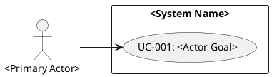

# Modeling Use Cases

Use this skill to model actor goals and system responsibilities as traceable use cases. Keep use cases at goal level; do not turn UI clicks, screens, or implementation steps into use cases.

## Required Inputs

Use available FRs, system context, actors, business rules, workflow notes, assumptions, and stakeholder statements. If a use case or flow needs missing information, do not invent it; list the gap and route it back to FR/context.

## Required Output

Produce these sections in order:

1. UC Register
2. Use-Case Details
3. PlantUML Use-Case Diagram
4. FR Coverage Accounting
5. FR/Context Gaps

## UC Register

| UC ID | Use case | Primary actor | Linked FR IDs | Trigger | Preconditions | Postconditions |
| --- | --- | --- | --- | --- | --- | --- |

Rules:
- Use stable UC IDs such as `UC-001`, `UC-002`, or established project prefixes.
- Link every UC to one or more FR IDs. If no FR supports a needed UC, use `Missing - FR/context gap GAP-###` and list it in `FR/Context Gaps`.
- Name each UC as an actor goal, such as `Request Return`, `Schedule Appointment`, or `Reset Password`.
- Do not name UCs after UI elements, screens, clicks, APIs, jobs, tables, or internal components.
- State one primary actor, trigger, preconditions, and postconditions for every UC.

## Use-Case Details

For each UC, use this compact structure:

```text
### UC-### - <Actor goal>
Linked FR IDs: <FR-###, FR-###>
Primary actor: <role/person>
Trigger: <event that starts the goal>
Preconditions: <state before the UC can start>
Postconditions: <state after success or controlled failure>

Main flow:
1. <actor intent or system responsibility>

Alternate flows:
A1. <variation from a numbered main-flow step and outcome>

Error flows:
E1. <failure condition, system response, and recovery or terminal outcome>
```

Flow rules:
- Main flow is the successful actor-goal path.
- Alternate flows are valid variations that still support the goal.
- Error flows are validation failures, unavailable dependencies, authorization failures, rule violations, expired state, or other exceptions.
- Flow steps may mention UI only when needed for clarity; they must describe meaningful actor/system interaction, not raw click sequences.
- Every alternate or error flow must reference the main-flow step it branches from, unless the flow applies globally.

## PlantUML Use-Case Diagram

Include a fenced `plantuml` diagram with:
- actors outside the system boundary;
- use cases inside the system boundary;
- actor-to-use-case associations;
- include/extend relationships only when they clarify required behavior.



## FR Coverage Accounting

Account for every provided FR before returning:

| FR ID | Coverage status | UC ID or disposition | Reason |
| --- | --- | --- | --- |

Coverage status must be one of:
- `covered`: represented by at least one UC;
- `excluded`: intentionally outside use-case scope, with a reason;
- `gap`: routed to `FR/Context Gaps` because context is missing, conflicting, or unsupported.

## FR/Context Gaps

List gaps whenever a use case, flow, actor, rule, precondition, postcondition, or diagram relationship lacks FR/context support.

| Gap ID | Location | Missing or conflicting item | Send back to |
| --- | --- | --- | --- |

`Send back to` should name the likely source to clarify or create, such as `FR`, `system context`, `business rule`, `actor model`, or `stakeholder decision`.

## Quality Gate

Before returning, verify:

- Every UC has a stable UC ID.
- Every UC links to FR IDs or a `Missing - FR/context gap GAP-###` placeholder.
- Every provided FR is accounted for as covered by at least one UC, intentionally excluded with a reason, or routed to FR/context gaps.
- Every UC has a primary actor, trigger, preconditions, and postconditions.
- Every UC has main, alternate, and error flows, or a gap explains why a flow type is unavailable.
- Every alternate and error flow references its originating main-flow step unless it applies globally.
- UC names describe user goals rather than UI steps.
- PlantUML is fenced as `plantuml`, keeps actors outside the boundary and UCs inside, and avoids include/extend relationships that do not clarify required behavior.
- Gaps are sent back to FR/context instead of hidden or resolved by invention.
